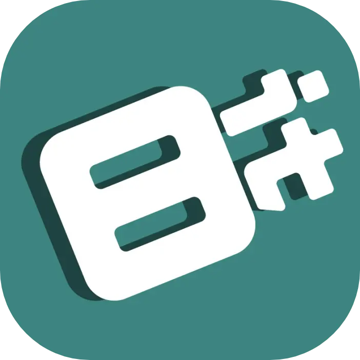

 

This website contains all organization information including members, services, projects and how to join. It also has an online learning portal used to teach new 8bit members the tech stack(s) of the organization.

Links: <a target="_blank" href="https://github.com/8bitUHM/8bit-site">GitHub Repository</a>, <a target="_blank" href="https://8bituhm.org/">Website</a>
