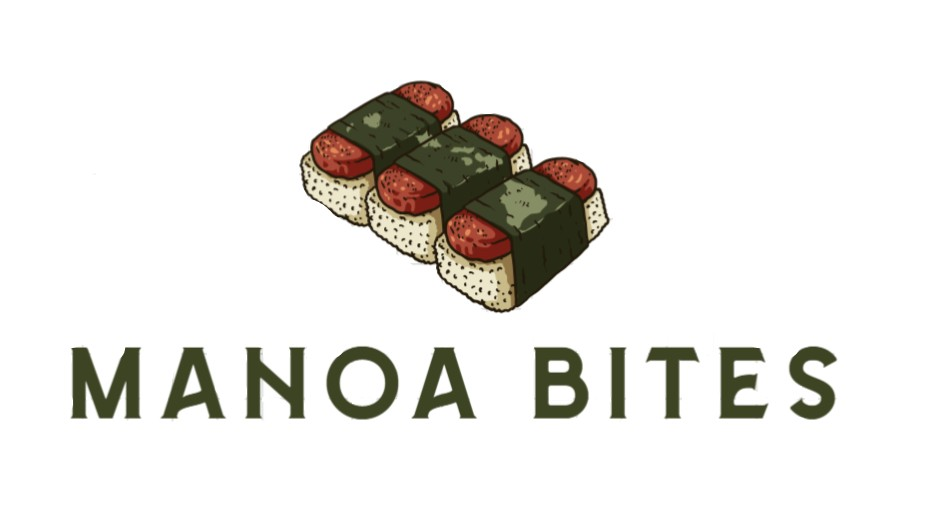

Manoa Bites is my Software Engineering class final project where we aimed to solve the problem of finding what/where to eat on UH Manoa Campus.
Using the ICS 314 development template which comes with built in auth and CMS capabilities, we were able to create a website to solve this problem.

## Links

View the live site <a target="_blank" href="https://manoa-bites.vercel.app">here</a>
View the project source code <a target="_blank" href="https://github.com/manoa-bites/manoa-bites">here</a>
Learn more about our project <a target="_blank" href="https://manoa-bites.github.io/">here</a>
View my team organization GitHub page <a target="_blank" href="https://github.com/manoa-bites">here</a>
